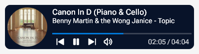
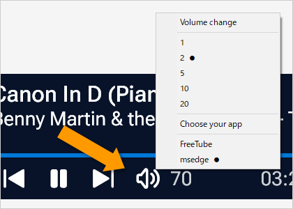

    

# NowPlaying Lite
  
A [Rainmeter](https://www.rainmeter.net/) NowPlaying skin for Microsoft Windows.  
[Rainmeter](https://www.rainmeter.net/) is a desktop customization tool for Microsoft Windows.  

## Download
📦 [NowPlaying-Lite.rmskin](https://github.com/nek7u/NowPlaying-Lite/releases/latest/download/NowPlaying-Lite.rmskin) (2.32 MB, GitHub.com)  
> SHA256 `d572d382d59be93c8452dc230df0fb679d3d5b8120f22d15ee31559546e941e6`  

> 📂 The default location of the skin installed  
> `C:\Users\%UserName%\Documents\Rainmeter\Skins\NowPlaying Lite`  

## Changelog
* 2024-08-14 (YYYY-MM-DD)
  * Initial release.

💡 **Volume controls are occasionally not working.**  

  
**You can fix that by...**  
1. Right-click on the speaker button.
2. Select app name from the context menu.  

## Acknowledgments
**App**
* [Rainmeter](https://www.rainmeter.net/) by [Developer team](https://github.com/rainmeter), [Brian](https://github.com/brianferguson), [jsmorley](https://github.com/jsmorley), [Community](https://forum.rainmeter.net/)  

**Plugins and Addons**
* [ActionTimer](https://docs.rainmeter.net/manual/plugins/actiontimer/), [RunCommand](https://docs.rainmeter.net/manual/plugins/runcommand/) by [Brian](https://github.com/brianferguson)
* [ConfigActive](https://forum.rainmeter.net/viewtopic.php?t=28720) by [jsmorley](https://github.com/jsmorley) and [TheAzack9](https://github.com/TheAzack9)
* [Mouse.dll](https://github.com/NighthawkSLO/Mouse.dll) by [NighthawkSLO](https://github.com/NighthawkSLO)
* [MediaPlayer](https://github.com/i2002/RainmeterMediaPlayer) by [i2002](https://github.com/i2002)
* [AppVolume](https://github.com/khanhas/AppVolumePlugin) by [khanhas](https://github.com/khanhas)
* [FileChoose](https://forum.rainmeter.net/viewtopic.php?t=33767) by Setsukka
* [nircmd.exe](https://www.nirsoft.net/utils/nircmd.html) (64 bit) by [NirSoft](https://www.nirsoft.net), SHA256 `7160DB2B7A6680480E64F0845512D203A575F807831FAF9A652AAEF0988F876C`

**Fonts & Icons**
* [tabler Icons](https://github.com/tabler/tabler-icons) by [Paweł Kuna](https://github.com/codecalm)
* Roboto Flex by [Google Fonts](https://fonts.google.com/?query=Roboto)

**Code & Techniques**
* [Advanced custom skin context menus](https://forum.rainmeter.net/viewtopic.php?t=20050) by [jsmorley](https://github.com/jsmorley)
* [#CURRENTSECTION# as a variable](https://forum.rainmeter.net/viewtopic.php?t=37787) by [Active Colors](https://www.deviantart.com/activecolors)
* Easing math functions by [https://easings.net](https://easings.net)

