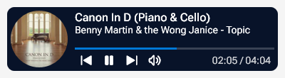
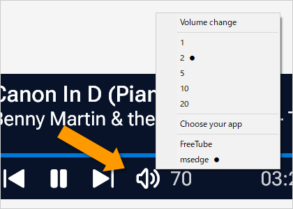

    

# NowPlaying Lite
  
A [Rainmeter](https://www.rainmeter.net/) NowPlaying skin for Microsoft Windows.  
[Rainmeter](https://www.rainmeter.net/) is a desktop customization tool for Microsoft Windows.  

## Download
📦 [NowPlaying-Lite.rmskin](https://github.com/nek7u/NowPlaying-Lite/releases/latest/download/NowPlaying-Lite.rmskin) (2.46 MB, GitHub.com)  
> SHA256 `12d3e10f57ba6ed95599e35d7d872940e87f9163fd2da7bc0f1b58ab5f05ae5b`  

> 📂 The default location of the skin installed  
> `C:\Users\%UserName%\Documents\Rainmeter\Skins\NowPlaying Lite`  

## Changelog
* 2026-05-15 (YYYY-MM-DD)  
  * Fixed an issue where searching by title or artist did not work.
  * Updated **Color Tool**, **Font Selector**, **Slider** skins.
  * Rewrote the code related to the context menu.
* 2024-09-27
  * Fixed garbled characters appears on the context menu.
  * Fixed command of desktop shortcut to load the skin.
* 2024-09-06
  * Added some option settings.
* 2024-08-15
  * Fixed some code.
* 2024-08-14
  * Initial release.

<!-- 💡 **Volume control is occasionally not working.**  -->

> [!NOTE]
> Volume control is occasionally not working.  
> **You can fix that by...**  
> 1. Right-click on the speaker button.  
> 2. Select app name from the context menu.    

  

## Usage

 

Controls|Mouse Action|Description
:-:|:-|:-
|Left-click|Play current track
|Left-click|Pause current track
|Left-click|Change to previous track
|Right-click|Jump to the beginning of the track
|Left-click|Change to next track
|Right-click|Jump to the end of the track
|Left-click|Mute
|Right-click|Show context menu
|Scroll|Change volume
Skin|Left-click|Play/Pause current track
Skin|Right-click|Show context menu
Skin|Middle-click|Refresh skin

## Acknowledgments
**App**
* [Rainmeter](https://www.rainmeter.net/) by [Developer team](https://github.com/rainmeter), [Brian](https://github.com/brianferguson), [jsmorley](https://github.com/jsmorley), [Community](https://forum.rainmeter.net/)  

**Plugins and Addons**
* [ActionTimer](https://docs.rainmeter.net/manual/plugins/actiontimer/), [RunCommand](https://docs.rainmeter.net/manual/plugins/runcommand/) by [Brian](https://github.com/brianferguson)
* [ConfigActive](https://forum.rainmeter.net/viewtopic.php?t=28720) by [jsmorley](https://github.com/jsmorley) and [TheAzack9](https://github.com/TheAzack9)
* [Mouse.dll](https://github.com/jsmorley/PluginMouse) by [NighthawkSLO](https://github.com/NighthawkSLO), fixed by [RicardoTM](https://github.com/RicardoTM05), shared by [jsmorley](https://github.jsmorleycom/jsmorley)
* [MediaPlayer](https://github.com/i2002/RainmeterMediaPlayer) by [i2002](https://github.com/i2002)
* [AppVolume](https://github.com/khanhas/AppVolumePlugin) by [khanhas](https://github.com/khanhas)
* [FileChoose](https://forum.rainmeter.net/viewtopic.php?t=33767) by Setsukka
* [nircmd.exe](https://www.nirsoft.net/utils/nircmd.html) (64 bit) by [NirSoft](https://www.nirsoft.net), SHA256 `7160DB2B7A6680480E64F0845512D203A575F807831FAF9A652AAEF0988F876C`
* [SetDpi.exe](https://github.com/imniko/SetDPI) by [imniko](https://github.com/imniko)

**Fonts & Icons**
* [tabler Icons](https://github.com/tabler/tabler-icons) by [Paweł Kuna](https://github.com/codecalm)
* Roboto Flex by [Google Fonts](https://fonts.google.com/?query=Roboto)

**Code & Techniques**
* [Advanced custom skin context menus](https://forum.rainmeter.net/viewtopic.php?t=20050) by [jsmorley](https://github.com/jsmorley)
* [#CURRENTSECTION# as a variable](https://forum.rainmeter.net/viewtopic.php?t=37787) by [Active Colors](https://www.deviantart.com/activecolors)
* Easing math functions by [https://easings.net](https://easings.net)

